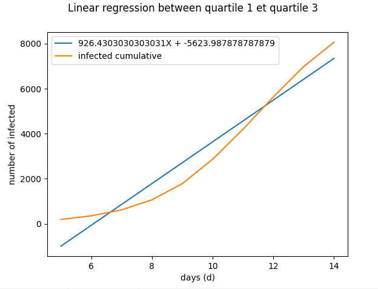

# Discret-event-virus-simulation

### installation 

go in your bash and execute
```bash
pip3 install simpy
pip3 install matplotlib.pyplot
pip3 install numpy
```
Version : python 3.6.9 64bits

### simpy 

[what is simpy ?](https://simpy.readthedocs.io/en/latest/simpy_intro/index.html).
we used simpy in order to make a discrete event simulation. 

### config file

```yaml
config:
    RANDOM_SEED : 1111
    NUM_AREA : 2                         # number of meeting zone (2 persons can be enter is this zone)
    TIMEMEET : 10                        # minutes staying in the meeting zone
    SIM_TIME : 20000                     # Simulation time in minutes (in one cycle)
    NUM_PERSON : 10000                   # number of person in the simulation
    NUM_TIPS : 3000                      # number of object (person) go in meeting zone (in one cycle)
    NUM_CYCLE_OUTPUT : 20                # number of cycle
```

### start my simulation
run this command in your shell in order to start the simulation
```bash
python3 simulation.py > log.txt 
```
this command allows you to write the application log in a txt file.

run this command in your shell in order to visualise the simulation.
```bash
python3 analyse.py 
```
analyse.py process the file log.txt

### resulats

#### without containment 


We observe that the number of infected people is increasing exponentially. The peak of infected people (blue curve) is reached with 1500 cases of contamination in only 1 day for a population of 10 000 inhabitants. 
Towards the end of the epidemic, the red curve becomes constant because the entire population has been infected. 

let's go into more detail



#### with containment 


### other
Here is the link to my non-discrete event simulation project: https://github.com/Debzou/SimulationVirusContainment
